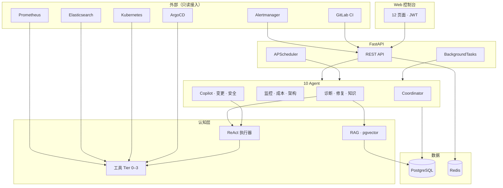
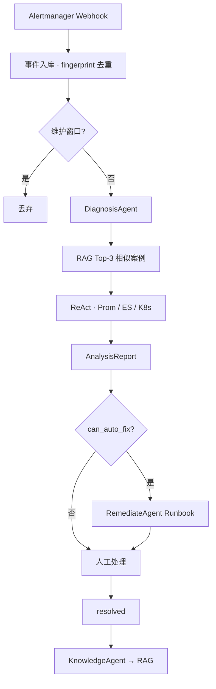
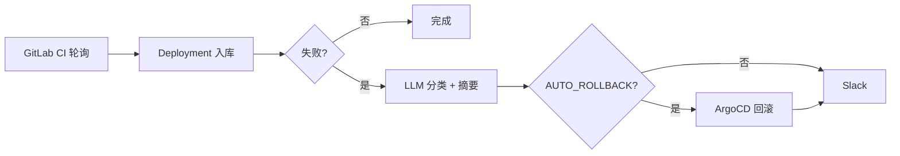
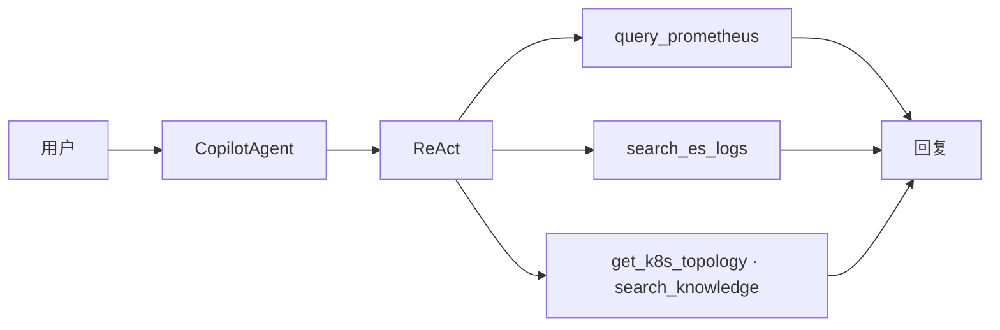

<p align="center">
  <strong>Shore</strong>
</p>

<p align="center">
  <sub>AI SRE 控制面：告警诊断 · 发布观测 · 巡检编排 · 知识归档 · Copilot</sub>
</p>

<p align="center">
  <a href="docs/ARCHITECTURE.md">架构</a> ·
  <a href="docs/CONFIG.md">配置</a> ·
  <a href="docs/INTEGRATION.md">集成</a>
</p>

<p align="center">
  
  
  
  
  
</p>

> **Shore 是 AIOps 控制面。** Web 控制台 + 10 Agent + RAG 知识库 + APScheduler 定时任务。只读接入 Prometheus / Elasticsearch / Alertmanager / GitLab / Kubernetes，在上面跑告警诊断、发布观测、巡检、Copilot 与知识归档。修复与集群变更默认 **plan-only**，显式开关 + operator 权限后才执行。

产品说明：[docs/ARCHITECTURE.md](docs/ARCHITECTURE.md)

---

## 这算什么

**一句话：** 告警、发布、日志、拓扑、历史案例进同一个控制面，10 个 Agent 分工处理，Coordinator 串流水线。

```text
Alertmanager → 事件入库 → DiagnosisAgent(RAG + ReAct) → AnalysisReport
  → [can_auto_fix] RemediateAgent Runbook → 关单 → KnowledgeAgent → RAG
  → 下次同类告警先命中历史
```

| 模块 | 路由 | 能力 |
|------|------|------|
| 全局总览 | `/` | 业务架构蓝图、KPI、集成状态 |
| 服务拓扑 | `/topology` | K8s 拓扑 + ES trace 调用链 |
| 事件中心 | `/incidents` | Alertmanager 接入、LLM 诊断、处理记录 |
| Pod 管理 | `/pods` | 命名空间 Pod、日志 |
| 发布管理 | `/deployments` | CI 扫描、构建分析、回滚 |
| 日志监控 | `/logs` | 关键字匹配、Slack 告警 |
| 监控巡检 | `/monitoring` | 定时巡检、Prometheus 异常 |
| 成本分析 | `/cost` | 资源成本、缩容建议 |
| 值班排班 | `/schedules` | 排班、近期值班 |
| 运维助手 | `/copilot` | ReAct 对话 |
| 知识库 | `/knowledge` | RAG 混合检索 |
| 安全合规 | `/security` | nmap / nuclei 扫描 |
| 平台设置 | `/settings` | 集成检查、维护窗口 |

---

## 架构



**边界**

```text
基础设施层   Prometheus · ES · Alertmanager · GitLab · K8s · ArgoCD
Shore 平台   本仓库 — Web UI · Agent · RAG · 事件/拓扑/知识库/审计
Hermes Ops Kit（可选）  env-map · 巡检 JSON · L0 Runbook 合同 → Shore 只读消费
```

---

## Agent

| Agent | 触发 | 输出 |
|-------|------|------|
| **诊断** | Alertmanager / 手动 / Coordinator | RAG → ReAct(Prom/ES/K8s) → `AnalysisReport` |
| **修复** | 诊断后 `can_auto_fix` | Runbook：重启 / 回滚 / 扩容 / 人工 |
| **知识** | 事件 `resolved` | LLM 整理 → 切块 embedding → pgvector |
| **监控** | 每 15min | Service 健康 + Prometheus 5xx Top10 |
| **成本** | 每天 06:00 | 月度成本估算 + 缩容建议 |
| **架构** | 每周一 09:00 | 依赖热点、单副本风险 |
| **Copilot** | 用户对话 | ReAct ≤6 轮，查指标/日志/事件/知识库 |
| **变更** | CI webhook（接管模式） | 评估 → 部署 → Prom 验证 → 回滚 → 入库 |
| **安全** | 每天 03:00 / 手动 | subfinder → httpx → nmap → nuclei + LLM 报告 |
| **Coordinator** | `POST /api/ops/coordinator/run` | `incident_response` · `daily_ops` · `on_call_check` |

---

## 定时任务

| 间隔 | 任务 |
|------|------|
| 5 min | K8s Discovery → 拓扑入库 |
| 2 min | GitLab CI 只读扫描 → Deployment 入库 |
| 15 min | Monitor Agent 巡检 |
| 06:00 daily | Cost Agent 成本分析 |
| 03:00 daily | Security Agent 全平台扫描 |
| Mon 09:00 | Architecture Agent 架构评审 |
| 持续 | 日志关键字监控 → Slack（可静默） |

---

## 主链路

### 告警闭环



状态机：`firing → acknowledged → analyzing → analyzed → resolved`

### 发布观测



默认 `BUILD_OBSERVE_MODE=true`（只观测）。接管模式走 ChangeAgent 六阶段，Prom 验错误率 + P95。

### Copilot



---

## 推理层

```text
┌─────────────────────────────────────────┐
│  DiagnosisAgent · CopilotAgent          │
├─────────────────────────────────────────┤
│  ReAct   LLM → tool_call → 观察 → 推理   │  ≤8 轮 · 工具返回 ≤2000 字
├─────────────────────────────────────────┤
│  Tools   Tier 0 指标/日志/拓扑            │
│          Tier 1 事件/知识库               │
│          Tier 3 restart_pod（需开关）     │
├─────────────────────────────────────────┤
│  RAG     向量 0.7 + 全文 0.3 → rerank 3  │  90 天窗口 · 服务标签过滤
├─────────────────────────────────────────┤
│  Output  root_cause · evidence · confidence · can_auto_fix
└─────────────────────────────────────────┘
```

ReAct 第 4 轮起压缩历史：保留 system + 首条 user + 最近 4 条。

→ [ARCHITECTURE.md §6–§7](docs/ARCHITECTURE.md)

---

## 提供 / 不提供

| 提供 | 不提供 |
|------|--------|
| 12 页 Web 控制台 + JWT | 替代 Prometheus / ES / Alertmanager |
| 10 Agent + Coordinator 三条流水线 | 跨环境 UI 切换 |
| Alertmanager webhook + 自动诊断 | 默认自动执行修复 |
| ReAct 工具调用 + RAG 混合检索 | 默认接管 CI 部署 |
| K8s 发现 + 拓扑 + trace | 日志监控自动建 Incident |
| GitLab CI 扫描 + 构建 LLM 分析 | |
| 日志监控 + Slack 脱敏告警 | |
| 安全扫描链 + 维护窗口 | |
| AgentRun 审计 | |

---

## Hermes Ops Kit

[Hermes Ops Kit](https://github.com/z35834491-cmyk/hermes-ops-kit) 提供 env-map、巡检 JSON、L0 Runbook 合同（plan-only）。Shore 是 Web/API 控制面，可读其合同形状。

```text
Ops Kit 合同  →  Shore 只读  →  Agent 推理  →  人确认  →  执行
```

---

## 文档

| 文档 | 内容 |
|------|------|
| [ARCHITECTURE.md](docs/ARCHITECTURE.md) | Agent 流程、ReAct、RAG、状态机、ER 图、部署拓扑 |
| [CONFIG.md](docs/CONFIG.md) | 环境变量 |
| [INTEGRATION.md](docs/INTEGRATION.md) | 外部系统接入 |
| [CICD_MIGRATION.md](docs/CICD_MIGRATION.md) | CI 迁移 |

---

## License

MIT © [sharkchenshun](https://github.com/sharkchenshun/shore)
