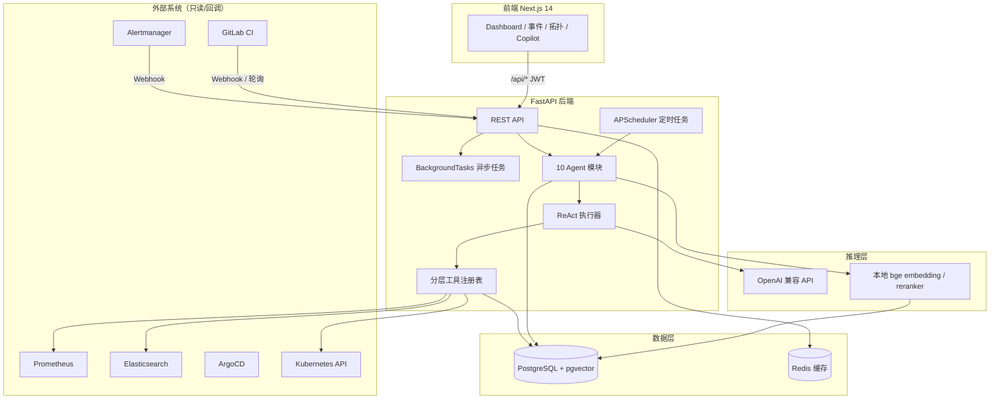
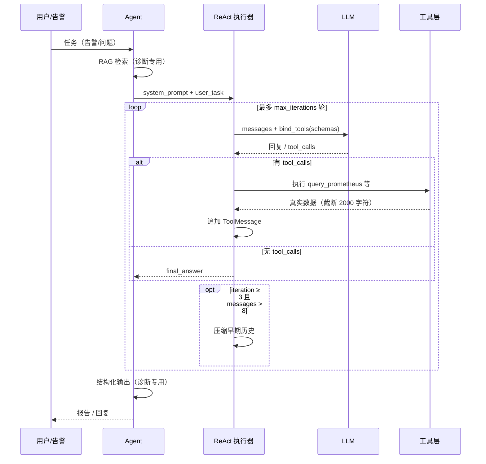
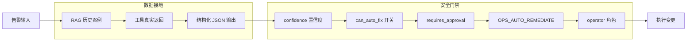
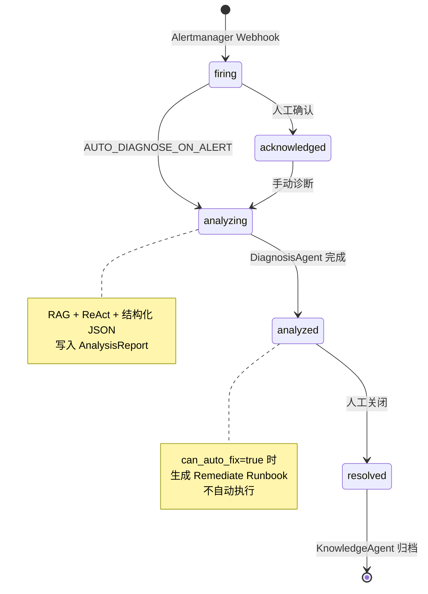
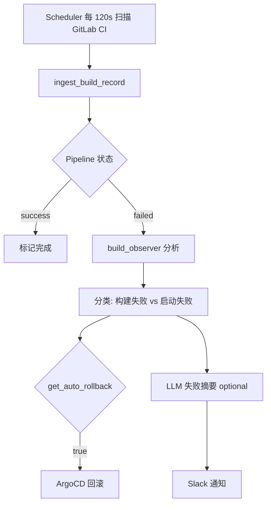
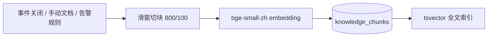
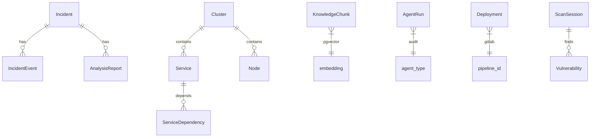
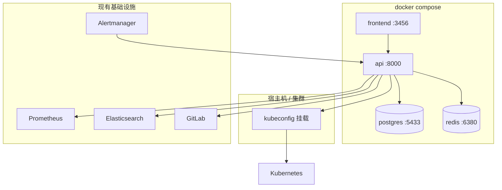

# Shore 系统架构

本文档描述 Shore AIOps 平台的整体架构、Agent 编排、上下文管理、幻觉控制策略及核心业务流程。面向运维工程师与平台开发者。

---

## 1. 设计目标

| 目标 | 实现方式 |
|------|----------|
| 复用现有基础设施 | 只读接入 Prometheus、Elasticsearch、Alertmanager、GitLab、ArgoCD、K8s API，不替代监控栈 |
| 单环境单实例 | 每个环境（test / prod）独立部署，`ENVIRONMENT` 注入，UI 不做环境切换 |
| 结论可验证 | ReAct + 工具调用，诊断结论必须引用 Prometheus / ES / K8s 等真实数据源 |
| 自动化可控 | 修复、回滚等变更操作默认仅生成方案，执行需 `OPS_AUTO_REMEDIATE=true` 且 operator 角色 |
| 知识沉淀 | 事件关闭后自动归档至 RAG，供后续诊断检索 |

---

## 2. 总体架构



### 2.1 技术栈

| 层级 | 组件 | 职责 |
|------|------|------|
| 前端 | Next.js 14、TypeScript、Tailwind | 运维控制台；`/api/*` 经 middleware 代理至后端 |
| API | FastAPI、APScheduler | REST 接口、定时任务、Webhook 接入 |
| Agent | LangChain ChatOpenAI、ReAct | 工具增强推理、结构化输出 |
| 数据 | PostgreSQL 16、pgvector | 业务数据、拓扑、事件、RAG 向量 |
| 缓存 | Redis 7 | 拓扑 trace 缓存、维护窗口、平台开关 |
| 推理 | OpenAI 兼容 HTTP API | 诊断、Copilot、知识整理、构建分析 |
| Embedding | bge-small-zh + bge-reranker-v2-m3 | 本地向量检索，无外部 API 依赖 |

---

## 3. Agent 体系

Shore 包含 **10 个专职 Agent**，按触发方式分为三类：

| 类型 | Agent | 触发 |
|------|-------|------|
| 事件驱动 | 诊断、修复、知识 | Alertmanager 告警、状态变更、Coordinator |
| 定时/扫描 | 监控、成本、架构、安全 | APScheduler |
| 用户/流水线 | Copilot、变更、Coordinator | API 对话、GitLab Webhook、编排 API |

### 3.1 Agent 一览

| Agent | 文件 | LLM | ReAct | 工具 Tier | 输出 |
|-------|------|:---:|:-----:|-----------|------|
| 诊断 Diagnosis | `agents/diagnosis/` | ✓ | ✓ T2 | T0–T2 | 结构化根因报告 `AnalysisReport` |
| 修复 Remediate | `agents/remediate/` | ✓ | ✗ | — | Runbook 方案（`requires_approval`） |
| 知识 Knowledge | `agents/knowledge/` | ✓ | ✗ | — | RAG 入库 `KnowledgeChunk` |
| 监控 Monitor | `agents/monitor/` | ✗ | ✗ | — | 服务健康 + Prometheus 5xx 排行 |
| 成本 Cost | `agents/cost/` | ✗ | ✗ | — | 月度成本估算 + 缩容建议 |
| 架构 Architecture | `agents/architecture/` | 可选 | ✗ | — | 依赖热点、单副本风险 |
| 助手 Copilot | `agents/copilot/` | ✓ | ✓ T2 | T0–T2 | 对话回复 + 工具调用日志 |
| 变更 Change | `agents/change/` | ✓ | ✗ | — | 6 阶段发布流水线结果 |
| 安全 Security | `agents/security/` | ✓ | ✗ | CLI | 漏洞扫描报告 |
| 调度 Coordinator | `agents/coordinator/` | ✗ | ✗ | — | 多 Agent 流水线编排 |

### 3.2 Agent 基类与配置

所有 Agent（Change / Security 除外）继承 `BaseAgent`，通过 `AgentConfig` 声明行为：

```python
@dataclass
class AgentConfig:
    name: str
    system_prompt: str
    max_tier: ToolTier = ToolTier.T0_ALWAYS   # 可用工具最高层级
    max_iterations: int = 8                    # ReAct 最大轮次
    requires_approval: bool = False            # 是否需人工审批
    temperature: float = 0.3
```

执行记录写入 `agent_runs` 表（监控、成本、架构、修复、Coordinator 等），供审计与前端展示。

---

## 4. ReAct 推理循环

诊断 Agent 与 Copilot 使用 **ReAct（Reason + Act）** 模式：LLM 决策 → 调用工具 → 观察结果 → 再决策，直到产出最终答案或达到迭代上限。



实现：`backend/app/agents/react.py`

---

## 5. 工具分层注册表

工具按 **Tier** 分级注入 LLM，避免一次性暴露全部 schema 占用 context window。

| Tier | 名称 | 工具 | 用途 |
|:----:|------|------|------|
| T0 | 常驻可观测 | `query_prometheus`、`search_es_logs`、`get_k8s_resource_status`、`get_k8s_topology` | 指标、日志、拓扑 |
| T1 | 计划/历史 | `list_recent_incidents`、`search_knowledge` | 事件历史、知识库 |
| T2 | 深度分析 | （继承 T0+T1） | 诊断、Copilot 分析阶段 |
| T3 | 变更动作 | `restart_pod` | 需 `OPS_AUTO_REMEDIATE=true` |

注册表：`backend/app/tools/registry.py`  
工具实现：`backend/app/tools/observability.py`、`backend/app/tools/ops.py`  
安全扫描工具（nmap、nuclei 等）由 Security Agent 直接调用 CLI，不经过 ReAct 注册表。

---

## 6. 上下文管理

LLM 上下文由多层策略共同控制，目标是在有限 token 预算内保留最关键信息。

### 6.1 上下文组成

| 阶段 | 内容 | 限制 |
|------|------|------|
| System Prompt | Agent 角色、行为约束（"不要编造数据"） | 固定 |
| RAG 注入（诊断） | Top-3 相似历史事件，每条 content 300 字符 | 诊断专用 |
| User Task | 告警标题、严重度、服务、详情 JSON | 按事件 |
| ReAct 工具结果 | 每次 ToolMessage | **≤ 2000 字符** |
| Copilot 历史 | 最近 6 轮对话 | 每轮 **≤ 500 字符** |
| 结构化二次 Pass | 自由文本 → JSON schema | temperature=0 |

### 6.2 长对话压缩

ReAct 循环在第 4 轮起（`iteration ≥ 3`）且消息数超过 8 条时，执行历史压缩：

```
保留：SystemMessage + 首个 HumanMessage + 占位提示 + 最近 4 条消息
丢弃：中间所有 ToolMessage / AIMessage
```

占位提示：`[早期分析步骤已省略以节约上下文]`

### 6.3 RAG 检索截断

| 参数 | 默认值 | 说明 |
|------|--------|------|
| `RAG_TOP_K` | 10 | 混合检索候选数 |
| `RAG_RERANK_TOP_N` | 3 | CrossEncoder 精排后注入数 |
| 注入 content 上限 | 1200 字符 | `retriever.py` |
| 检索时间窗 | 90 天 | SQL 过滤 |
| 服务过滤 | 可选 | `affected_services` 标签匹配 |

### 6.4 Token 预算

| 配置项 | 默认 | 说明 |
|--------|------|------|
| `LLM_MAX_TOKENS` | 4096 | 单次 LLM 回复上限 |
| 诊断 temperature | 0.2 | 降低随机性 |
| 结构化输出 temperature | 0 | 确定性 JSON 提取 |
| 构建失败日志分析 | 6000 字符 tail | `build_observer.py` |

---

## 7. 幻觉控制策略

Shore 不依赖单一 prompt 约束，而是采用 **多层 grounding + 人工门禁**：



### 7.1 策略明细

| 策略 | 机制 | 代码位置 |
|------|------|----------|
| **工具接地** | 系统 prompt 要求"所有结论必须有工具返回的证据"；ReAct 强制 LLM 通过 PromQL / ES / K8s 查询验证假设 | `diagnosis/agent.py`, `copilot/agent.py` |
| **RAG 接地** | 诊断前先检索 90 天内相似事件，注入 prompt 作为先验 | `rag/retriever.py` |
| **结构化输出** | 诊断二阶段：自由文本 → 强制 JSON（`root_cause`, `evidence[]`, `confidence`, `can_auto_fix`） | `diagnosis/agent.py::_structure` |
| **证据持久化** | `AnalysisReport.evidence[]` 写入 PostgreSQL，前端可审计 | `models/incident.py` |
| **置信度分级** | `high / medium / low`；解析失败时降级为 `low` | 诊断 Agent |
| **自动修复门禁** | 仅 `can_auto_fix=true` 时生成 Runbook；**不自动执行** | `incidents.py`, `remediate/agent.py` |
| **执行双重锁** | `OPS_AUTO_REMEDIATE=false`（默认）+ `requires_approval=true` + operator JWT | `config.py`, `remediate/agent.py` |
| **维护窗口抑制** | 发布维护期间 Redis 维护窗口，Alertmanager 告警不创建事件 | `maintenance.py` |
| **重复事件升级** | 7 天内同标题+同服务重复触发 → severity 升为 `critical` | `incident_service.py` |
| **LLM 不可用降级** | 无 API Key 时跳过 LLM Agent；Monitor/Cost 纯规则运行 | 各 Agent |
| **本地 Embedding** | RAG 向量化不依赖外部 API，检索结果确定性 | `rag/embedding.py` |

### 7.2 Copilot 约束

Copilot 系统 prompt 明确要求：

> 回答要具体、可操作，基于工具返回的真实数据。不知道就说不知道，别编。

对话历史仅保留最近 6 轮，防止无关上下文干扰。

---

## 8. 核心业务流程

### 8.1 告警 → 诊断 → 修复 → 知识归档



**详细步骤：**

1. `POST /api/incidents/alertmanager` 接收 Alertmanager payload
2. `upsert_incident` 按 fingerprint 去重；维护窗口内告警丢弃
3. 新 firing 事件 + `AUTO_DIAGNOSE_ON_ALERT=true` → BackgroundTasks 触发 `_run_diagnosis`
4. **DiagnosisAgent**：`hybrid_search` → ReAct（Prometheus/ES/K8s）→ `_structure` 结构化
5. 写入 `AnalysisReport`，事件状态 → `analyzed`，Slack 通知
6. 若 `can_auto_fix=true` → **RemediateAgent.plan** 生成 Runbook（restart/rollback/scale/manual）
7. Operator `PATCH /api/incidents/{id}/status` → `resolved`
8. **KnowledgeAgent.archive_incident** → LLM 整理 → `rag/ingest` 入库

事件状态机（合法转换）：

```
firing → acknowledged | resolved
acknowledged → analyzing | resolved
analyzing → analyzed | resolved
analyzed → resolved
```

### 8.2 GitLab CI → 构建观测 / 变更接管

**默认模式**（`BUILD_OBSERVE_MODE=true`）：只读扫描，不接管部署。



**接管模式**（`BUILD_OBSERVE_MODE=false` + webhook `takeover_deploy=true`）：

**ChangeAgent** 六阶段流水线：

1. 风险评估
2. ArgoCD 部署
3. Prometheus 验证（错误率 + P95 延迟）
4. 决策：成功 / 根因分析
5. 不健康时自动回滚
6. 知识入库 + 创建失败事件

### 8.3 定时运维任务

| 任务 | Cron/Interval | Agent | 说明 |
|------|---------------|-------|------|
| K8s 发现 | 300s | DiscoveryEngine | 拓扑 upsert |
| 监控巡检 | 900s | MonitorAgent | 服务副本 + Prometheus 5xx |
| 成本分析 | `0 6 * * *` | CostAgent | 资源成本估算 |
| 架构分析 | `0 9 * * 1` | ArchitectureAgent | 依赖热点 |
| 安全扫描 | `0 3 * * *` | SecurityAgent | 全平台漏洞扫描 |
| GitLab CI | 120s | gitlab_ci_scanner | Pipeline 状态同步 |
| 日志监控 | 持续 | log_monitor engine | 关键字匹配 → Slack |

### 8.4 Coordinator 编排流水线

`POST /api/ops/coordinator/run`

| Pipeline | 步骤 |
|----------|------|
| `incident_response` | DiagnosisAgent →（can_auto_fix）RemediateAgent.plan |
| `daily_ops` | MonitorAgent.patrol → CostAgent.analyze |
| `on_call_check` | 读取最近 5 条 Schedule，返回值班信息 |

---

## 9. RAG 知识库

### 9.1 入库流程



**源类型：** `incident_resolution` · `manual_document` · `alert_rule` · `log_pattern` · `k8s_event_pattern`

### 9.2 混合检索

```
score = cosine_similarity × 0.7 + ts_rank × 0.3
→ CrossEncoder rerank → Top-N 注入 prompt
```

过滤：90 天内 + 可选 `affected_services` 标签匹配。

---

## 10. 数据模型



| 模型 | 表 | 用途 |
|------|-----|------|
| `Incident` | incidents | 告警事件生命周期 |
| `AnalysisReport` | analysis_reports | LLM 诊断结果 + evidence |
| `Service` / `ServiceDependency` | services / service_dependencies | K8s 拓扑 |
| `KnowledgeChunk` | knowledge_chunks | RAG 向量 + 全文 |
| `AgentRun` | agent_runs | Agent 执行审计 |
| `Deployment` | deployments | GitLab CI 构建记录 |
| `MonitorTask` | monitor_tasks | 日志监控任务配置 |

---

## 11. API 与前端

### 11.1 API 路由

| 前缀 | 模块 | 职责 |
|------|------|------|
| `/api/incidents` | 事件 | CRUD、Alertmanager、诊断 |
| `/api/ops` | 运维 Agent | 巡检、成本、Copilot、Coordinator |
| `/api/deployments` | 发布 | GitLab 扫描、Webhook、回滚 |
| `/api/topology` | 拓扑 | 图数据、trace |
| `/api/knowledge` | 知识库 | 混合检索 |
| `/api/security` | 安全 | 扫描任务 |
| `/api/monitor` | 日志监控 | 任务配置、日志查询 |
| `/api/settings` | 设置 | 集成健康检查、维护窗口 |
| `/api/home` | 首页 | 业务架构总览 |

认证：JWT Bearer。`AUTH_REQUIRED=false` 时开发模式返回 dummy admin；生产环境需配置 `AUTH_REQUIRED=true`。

### 11.2 前端架构

- **框架：** Next.js 14 App Router
- **API 代理：** `middleware.ts` 将 `/api/*` 转发至 `INTERNAL_API_URL`
- **状态：** `src/lib/api.ts` 封装 JWT + `apiJson()`
- **鉴权：** `src/lib/auth.tsx` Context Provider

---

## 12. 部署拓扑



- 每个环境独立 compose 实例
- API 容器挂载宿主机 kubeconfig（`- ${KUBECONFIG:-~/.kube/config}:/tmp/kubeconfig.orig:ro`）
- Prometheus / ES / GitLab 不在 compose 内，通过 `.env` 配置 URL

---

## 13. 扩展指南

| 需求 | 做法 |
|------|------|
| 新增 Agent | 继承 `BaseAgent`，注册至 `ops.py` API + scheduler |
| 新增工具 | `@register_tool` 装饰器，选择 Tier，在 Agent `max_tier` 中启用 |
| 更换 LLM | 修改 `LLM_API_KEY` / `LLM_BASE_URL` / `LLM_MODEL`（OpenAI 兼容） |
| 启用 RAG | `pip install -r requirements-ml.txt`（~2GB torch） |
| 启用自动修复 | `OPS_AUTO_REMEDIATE=true` + operator 手动触发 execute |
| 自定义业务架构 | 编辑 `backend/config/environment-architecture.json` |

---

## 14. 相关文档

- [CONFIG.md](./CONFIG.md) — 环境变量参考
- [INTEGRATION.md](./INTEGRATION.md) — 外部系统集成指南
- [CICD_MIGRATION.md](./CICD_MIGRATION.md) — CI/CD 迁移说明
